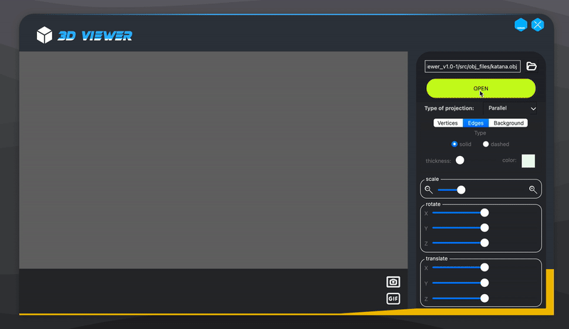

# 3DViewer v1.0

This project is part of the curriculum of [School 21](https://21-school.ru/). Based on the task, a 3D viewer program was implemented to view 3D wireframes, as well as various transformations and movements using affine transformations. The program was written in pure C, following the principles of structured programming, and the Qt framework was used for the user interface (UI).

## Contents

1. [Installation and commands](#installation-and-commands)
2. [Calculator overview](#calculator-overview)
3. [Tests](#tests)
4. [Technical](#technical-specifications)

## Installation and commands

You will need the following utilities to install `gcc`, `make` and `qmake`

##### Makefile targets:

- **install**  
  Installs the calculator in the build folder and on the desktop

- **uninstall**  
  Uninstall the calculator

- **dvi**  
  Opens project documentation

- **dist**  
  Generates distribution `.tgz` with an executable and necessary documentation

- **test**  
  Start testing calculator modules and its controller. The report can be viewed in the `/tests/logs` folder

- **gcov_report**  
  Generates an html report displaying the coverage of all functions by tests

- **valgrind_check**  
  Initializes the check of the project by the valgrind utility, after which log files with reports are created

## Calculator overview

## Tests

- Tests were written using [check](https://libcheck.github.io/check/) library // coverage report using [LCOV](https://github.com/linux-test-project/lcov)

## Technical specifications

You need to develop a program to visualise 3D wireframe models:

- The program must be developed in C language of C11 standard using gcc compiler. You can use any additional QT libraries and modules
- The program code must be located in the src folder
- The program must be built with Makefile which contains standard set of targets for GNU-programs: all, install, uninstall, clean, dvi, dist, tests, gcov. Installation directory could be arbitrary, except the building one
- The program must be developed according to the principles of structured programming
- When writing code it is necessary to follow the Google style
- Prepare full coverage of modules related to model loading and affine transformations with unit-tests
- There should be only one model on the screen at a time
- The program must provide the ability to:
    - Load a wireframe model from an obj file (vertices and surfaces list support only).
    - Translate the model by a given distance in relation to the X, Y, Z axes.
    - Rotate the model by a given angle relative to its X, Y, Z axes.
    - Scale the model by a given value.
- GUI implementation, based on any GUI library with API for C89/C99/C11  
  * For Linix: GTK+, CEF, Qt 
  * For Mac: GTK+, Nuklear, raygui, microui, libagar, libui, IUP, LCUI, CEF, Qt
- The graphical user interface must contain:
    - A button to select the model file and a field to output its name.
    - A visualisation area for the wireframe model.
    - Button/buttons and input fields for translating the model.
    - Button/buttons and input fields for rotating the model.
    - Button/buttons and input fields for scaling the model.
    - Information about the uploaded model - file name, number of vertices and edges.
- The program must correctly processes and allows user to view models with details up to 100, 1000, 10,000, 100,000, 1,000,000  vertices without freezing (a freeze is an interface inactivity of more than 0.5 seconds)

### Bonus. Settings

- The program must allow customizing the type of projection (parallel and central)
- The program must allow setting up the type (solid, dashed), color and thickness of the edges, display method (none, circle, square), color and size of the vertices
- The program must allow choosing the background color
- Settings must be saved between program restarts

### Bonus. Record

- The program must allow saving the captured (rendered) images as bmp and jpeg files.
- The program must allow recording small screencasts by a special button - the current custom affine transformation of the loaded object into gif-animation (640x480, 10fps, 5s)
