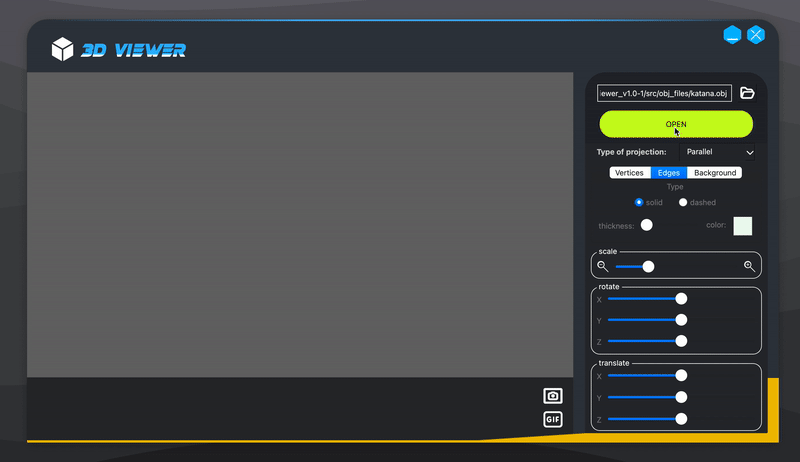

# 3DViewer v1.0

Этот проект является частью учебной программы [Школы 21](https://21-school.ru/). Исходя из задания, была реализована программа 3D-просмотра различных трехмерных обьектов, а также различные трансформации и перемещения с использованием афинных преобразований. Программа была написана на чистом языке C, соблюдая принципы структурированного программирования, а для пользовательского интерфейса (UI) использовался фреймворк Qt.

## Содержание

1. [Обзор приложения](#обзор-приложения)
2. [Установка и команды](#установка-и-команды)
3. [Участники проекта](#участники-проекта)
4. [Тесты](#тесты)
5. [Технические требования](#технические-требования)

## Обзор приложения

## Установка и команды

You will need the following utilities to install `gcc`, `make` and `qmake`

##### Makefile цели:

* **install**  
Устанавливает калькулятор в папку build и на рабочий стол

* **uninstall**  
Удаляет калькулятор

* **dvi**  
Открывает документацию по проекту

* **dist**  
Генерирует дистрибутив `.tgz` с исполняемым файлом и необходимой документацией

* **test**  
Запуск тестирования модулей калькулятора и его контроллера. Отчет можно посмотреть в папке /tests/logs

* **gcov_report**  
Генерирует html отчет с отображением покрытия всех функций тестами

* **valgrind_check**  
Инициализирует проверку проекта valgrind, после этого создаются лог файлы с отчетами

## Участники проекта

|                       
 Member 
                             |              Area of ​​responsibility         |
|-----------------------------------------------------------------------------|--------------------------------------------|
|   
[// sheritsh](https://github.com/sheritsh)
 | Парсер .obj файлов   Визуальный интерфейс / Qt UI   Взаимодействие и логика частей приложения |
|   
[// klotzgal](https://github.com/klotzgal)
| Аффинные преобразования   Юнит-тесты   Поддержка проекта и его тестирование  |

## Тесты

- Тесты были написаны с использованием библиотеки [check](https://libcheck.github.io/check/) // отчет о покрытии при помощи [LCOV](https://github.com/linux-test-project/lcov)

## Технические требования

Разработать программу для визуализации каркасной модели в трехмерном пространстве:

- Программа должна быть разработана на языке Си стандарта C11 с использованием компилятора gcc. Допустимо использование дополнительных библиотек и модулей QT
- Код программы должен находиться в папке src 
- Сборка программы должна быть настроена с помощью Makefile со стандартным набором целей для GNU-программ: all, install, uninstall, clean, dvi, dist, tests, gcov_report. Установка должна вестись в любой другой произвольный каталог
- Программа должна быть разработана в соответствии с принципами структурного программирования
- При написании кода необходимо придерживаться Google Style
- Должно быть обеспечено покрытие unit-тестами модулей, связанных с загрузкой моделей и аффинными преобразованиями
- В один момент времени должна быть только одна модель на экране.
- Программа должна предоставлять возможность:
    - Загружать каркасную модель из файла формата obj (поддержка только списка вершин и поверхностей).
    - Перемещать модель на заданное расстояние относительно осей X, Y, Z.
    - Поворачивать модель на заданный угол относительно своих осей X, Y, Z
    - Масштабировать модель на заданное значение.
- В программе должен быть реализован графический пользовательский интерфейс, на базе любой GUI-библиотеки с API для C89/C99/C11  
  * For Linix: GTK+, CEF, Qt 
  * For Mac: GTK+, Nuklear, raygui, microui, libagar, libui, IUP, LCUI, CEF, Qt
- Графический пользовательский интерфейс должен содержать:
    - Кнопку для выбора файла с моделью и поле для вывода его названия.
    - Зону визуализации каркасной модели.
    - Кнопку/кнопки и поля ввода для перемещения модели. 
    - Кнопку/кнопки и поля ввода для поворота модели. 
    - Кнопку/кнопки и поля ввода для масштабирования модели.  
    - Информацию о загруженной модели - название файла, кол-во вершин и ребер.
- Программа должна корректно обрабатывать и позволять пользователю просматривать модели с деталями до 100, 1000, 10 000, 100 000, 1 000 000 вершин без зависания (зависание - это бездействие интерфейса более 0,5 секунды).

## Дополнительно. Настройки

 - Программа должна позволять настраивать тип проекции (параллельная и центральная)
 - Программа должна позволять настраивать тип (сплошная, пунктирная), цвет и толщину ребер, способ отображения (отсутствует, круг, квадрат), цвет и размер вершин
 - Программа должна позволять выбирать цвет фона
 - Настройки должны сохраняться между перезапусками программы

 ## Дополнительно. Запись

 - Программа должна позволять сохранять полученные ("отрендеренные") изображения в файл в форматах bmp и jpeg
 - Программа должна позволять по специальной кнопке записывать небольшие "скринкасты" - текущие пользовательские аффинные преобразования загруженного объекта в gif-анимацию (640x480, 10fps, 5s)
